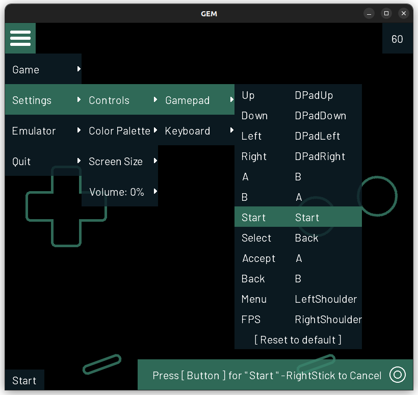

# GEM
**Game Boy Emulator Multiplatform**

GEM is a Game Boy emulator written in C# using [MonoGame](https://www.monogame.org/) framework.

This is a personal hobby and learning project inspired by [The Ultimate Game Boy Talk](https://media.ccc.de/v/33c3-8029-the_ultimate_game_boy_talk) by Michael Steil.

## Disclaimer
- :warning: Work in progress - expect glitches and crashes 
- :warning: Executable seems to cause virus alerts on windows

## Screenshots

  
  

## References
Game Boy is well documented and there are many great reference pages out there. This is a small selection of those which helped me most:
- [Pan Docs](https://gbdev.io/pandocs/About.html) - Game Boy documentation since 1995
- [Imran Nazar](http://imrannazar.com/GameBoy-Emulation-in-JavaScript:-The-CPU) - Game Boy Emulation in JavaScript
- [OpCodes](https://gbdev.io/gb-opcodes/optables/) - CPU instruction table

Sound:
- [Nightshade](https://nightshade256.github.io/2021/03/27/gb-sound-emulation.html) - Game Boy Sound Emulation
- [David Gouveia](https://www.david-gouveia.com/creating-a-basic-synth-in-xna-part-i) - Sound in XNA
