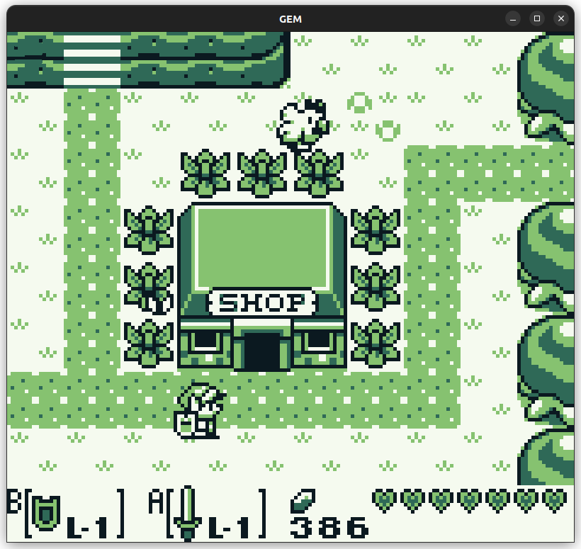

# GEM
GB Emulator Multiplatform

Written in C# using [MonoGame](https://www.monogame.org/)

Personal hobby and learning project inspired by [The Ultimate Game Boy Talk](https://www.youtube.com/watch?v=HyzD8pNlpwI)

:warning::warning::warning: Early work in progress - expect glitches and crashes :warning::warning::warning:

